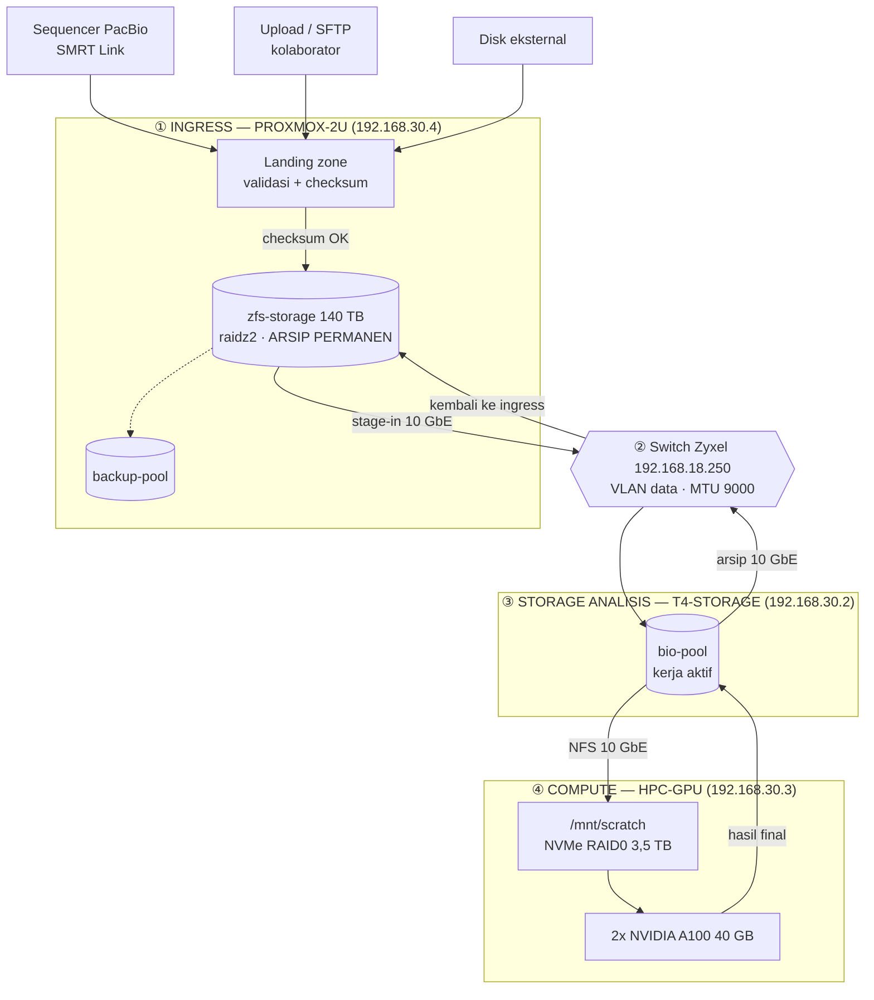

# Server Infrastructure — Bioinformatics Bare-Metal Cluster

> **REPOSITORY PRIVATE — INTERNAL USE ONLY**
> Repo ini berisi data aset, alamat IP manajemen (IPMI/iDRAC), topologi jaringan,
> dan serial number perangkat. **Dilarang** menjadikan repo ini public,
> fork ke akun personal, atau mem-push kredensial dalam bentuk apa pun.

| Item | Nilai |
|---|---|
| Nama Sistem | Bioinformatics HPC & Storage Infrastructure |
| Tipe Deployment | **100% Bare-Metal** (tanpa cloud, tanpa hypervisor di node compute) |
| Lokasi | Data Center Internal — Ruang Server Lantai 2 |
| Domain Internal | `.hpc.local` |
| Versi Dokumentasi | `v1.0.0` |
| Terakhir Diperbarui | 2026-09-02 |
| Pengelola (Sysadmin) | *(isi nama PIC)* |
| Kontak Darurat | *(isi email / no. HP)* |

---

## 1. Ringkasan

Infrastruktur ini didedikasikan untuk workload **bioinformatics**:
WGS/WES variant calling, RNA-Seq, assembly de-novo, metagenomics,
single-cell, dan alignment skala besar.

Karakteristik workload yang jadi dasar semua keputusan desain:

- **I/O-bound berat** — file intermediate (`.sam`) bisa 5–10× lebih besar dari input.
- **RAM-hungry** — assembler (SPAdes, Trinity) & STAR index bisa >200 GB RAM per job.
- **Long-running** — job bisa berjalan 12 jam – 7 hari, tidak boleh mati karena SSH putus.
- **Reproducibility wajib** — setiap tool dikunci versi via Conda env / Singularity image.

Konsekuensi arsitektural:
1. Scratch berbasis **NVMe lokal** dipisah total dari storage arsip.
2. Semua job **wajib** lewat scheduler (Slurm), tidak boleh nempel di sesi SSH.
3. Dokumentasi dibuat **per-unit fisik**, bukan per-cluster, karena setiap
   chassis punya serial, garansi, dan riwayat maintenance sendiri.

---

## 2. Arsitektur Umum

Infrastruktur ini terdiri dari **tiga server bare-metal**, **satu switch Zyxel**,
dan **satu ONT** dari ISP. Bagian ini memuat empat hal yang sengaja dipisah:

- **§2.1 Keadaan sekarang** — apa yang benar-benar terpasang hari ini.
- **§2.2 Arsitektur target** — ke mana kita menuju: **PROXMOX-2U sebagai *ingress data***.
- **§2.6 Rancangan jaringan yang aman** — pemisahan VLAN yang seharusnya ada.
- **§2.7 Ringkasan kekurangan** — apa saja yang masih belum beres.

> ⚠️ **Jangan tertukar.** Diagram target **belum terwujud**. Yang membedakan
> keduanya hanya satu hal: **proxmox belum punya kaki di jalur data 10 GbE**.
> Daftar pekerjaannya ada di [§2.5](#25-jalan-menuju-target).

---

### 2.1 Keadaan Sekarang

```
                                 ☁  INTERNET (fiber ISP)
                                          │
                              ┌───────────┴────────────┐
                              │      ONT HUAWEI        │   192.168.18.1
                              │  78:5C:5E:C5:9A:72     │   gateway + DHCP + DNS
                              │  ⚠️ dikelola ISP        │   port 53 & 80 terbuka
                              └───────────┬────────────┘
                                          │  LAN / RJ45 1 GbE
                                          ▼
   ╔═══════════════════════════════════════════════════════════════════════════╗
   ║           ZYXEL MGS3520-28FX   ·   192.168.18.250   ·   S175852000302     ║
   ║        firmware V1.06 (2019) · MTU 10248 (jumbo ON) · PSU tunggal AC      ║
   ║   🔴 SPOF ABSOLUT — semua trafik lewat sini · password masih default       ║
   ╚═╤═════════╤═════════╤═════════╤══════════════════╤═════════╤═════════╤════╝
    e0/0/1    e0/0/2    e0/0/3    e0/0/4          e0/0/25   e0/0/26   e0/0/28
    1 GbE     1 GbE     1 GbE     1 GbE            SFP+      SFP+      SFP+
    VLAN 1    VLAN 1    VLAN 1    VLAN 1          KOSONG   VLAN 30   VLAN 30
      │         │         │         │                │        │         │
      │         │         │         │          ⭐ untuk       │         │
      │         │         │         │           PROXMOX       │         │
      ▼         ▼         ▼         ▼                         ▼         ▼
  ┌───────┐ ┌───────┐ ┌────────┐ ┌──────────┐          ┌─────────┐ ┌────────┐
  │  ONT  │ │HPC-GPU│ │PROXMOX │ │T4-STORAGE│          │   T4-   │ │ HPC-   │
  │ .18.1 │ │.18.178│ │ .18.190│ │  .18.193 │          │ STORAGE │ │  GPU   │
  │       │ │  +BMC │ │  +BMC  │ │   +BMC   │          │ .30.2   │ │ .30.3  │
  │  + ?  │ │  .119 │ │  .13   │ │   .200   │          └────┬────┘ └───┬────┘
  └───────┘ └───────┘ └────────┘ └──────────┘               │          │
      ▲         ▲         ▲          ▲                      └───NFS────┘
      │         └─────────┴──────────┘                        10 GbE
   perangkat    🔴 BMC BERBAGI PORT dengan host            MTU 9000
   tak dikenal     (NC-SI) — tidak bisa dipisah
   50:e9:71:..     dengan memindahkan kabel

   Port kosong: e0/0/5–e0/0/24 (20× 1 GbE) · e0/0/25, e0/0/27 (2× SFP+ 10 GbE)

    ═══ VLAN 1  192.168.18.0/24 ═══  semua server + SELURUH BMC + ONT, satu segmen
    ═══ VLAN 30 "SERVERS" .30.0/24 ═══  jalur data, hanya e0/0/26 & e0/0/28

    Akses admin jarak jauh:  ☁ Cloudflare Zero Trust (WARP) → LAN server
                             ⚠️ lokasi connector belum teridentifikasi
```

| Kenyataan hari ini | Akibatnya |
|---|---|
| **Password admin switch masih default pabrik**, manajemen hanya Telnet + HTTP | Siapa pun di LAN bisa ambil alih switch, lalu menyadap seluruh trafik lewat port mirroring |
| **Semua lewat satu switch Zyxel**, PSU tunggal, tanpa redundansi | Switch atau PSU-nya mati = internet, LAN, jalur data, **dan** akses BMC hilang serentak |
| **Ketiga BMC di VLAN 1 bersama server, dan berbagi port fisik dengan host-nya** | BMC = kendali setara akses fisik, terjangkau dari seluruh LAN — dan **tidak bisa dipisah dengan memindahkan kabel** |
| **Firmware switch dari 2019** (± 7 tahun) | Tertinggal perbaikan keamanan |
| **Proxmox hanya 1 GbE** dan tidak ada di `192.168.30.0/24` | Memindahkan 1 TB arsip butuh ± 3 jam. Arsip 140 TB praktis terkurung |
| **Tidak ada titik ingress yang jelas** | Data masuk lewat jalur tidak seragam, tanpa validasi/checksum terpusat |
| **T4-Storage merangkap storage + monitoring** | Satu node mati = job berhenti **dan** visibilitas hilang bersamaan |
| **ONT merangkap gateway + DNS**, tanpa firewall internal | ONT bermasalah = resolusi nama seluruh server ikut mati |
| **Slurm controller (`192.168.18.194`) mati** | Penjadwalan tidak jalan; `HPC-GPU` dipakai interaktif |
| **2× Tesla T4 di proxmox menganggur** (driver `nouveau`, tanpa passthrough) | Kapasitas GPU terpasang tapi tidak terpakai sama sekali |

---

### 2.2 Arsitektur Target — Proxmox sebagai Ingress Data

Semua data baru **masuk lewat satu pintu**: `PROXMOX-2U`. Di sana data
divalidasi, di-checksum, dan diarsipkan, baru kemudian disalurkan ke tier
analisis. Tidak ada data yang langsung mendarat di storage analisis.

```
   SUMBER DATA EKSTERNAL
   ┌──────────────────┐  ┌──────────────────┐  ┌──────────────────┐
   │ Sequencer PacBio │  │ Upload / SFTP    │  │ Hard disk        │
   │ (SMRT Link)      │  │ kolaborator      │  │ eksternal        │
   └────────┬─────────┘  └────────┬─────────┘  └────────┬─────────┘
            │                     │                     │
            └─────────────────────┼─────────────────────┘
                                  ▼
        ╔═════════════════════════════════════════════════════════╗
        ║                  ①  INGRESS                             ║
        ║                    PROXMOX-2U                           ║
        ║           192.168.18.190  ·  192.168.30.4 ⭐            ║
        ║                                                         ║
        ║   • Landing zone — data mentah mendarat di sini         ║
        ║   • Validasi + checksum (md5/sha256) sebelum diterima   ║
        ║   • VM ingest (SMRT Link, SFTP, konversi format)        ║
        ║   • ARSIP PERMANEN  →  zfs-storage 140 TB raidz2        ║
        ║   • Backup target   →  backup-pool                      ║
        ╚════════════════════════════╤════════════════════════════╝
                                     │ ⭐ 10 GbE SFP+ (MTU 9000)  — LINK BARU
                                     ▼
                        ┌─────────────────────────┐
                        │   ②  SWITCH ZYXEL       │
                        │      192.168.18.250     │
                        │   VLAN data 192.168.30  │
                        │   jumbo frame ON        │
                        └───────┬─────────┬───────┘
                     10 GbE     │         │     10 GbE
              ┌─────────────────┘         └─────────────────┐
              ▼                                             ▼
   ╔══════════════════════════╗              ╔══════════════════════════╗
   ║   ③  STORAGE ANALISIS    ║   NFS 10G    ║   ④  COMPUTE             ║
   ║      T4-STORAGE          ║◄════════════►║      HPC-GPU             ║
   ║      192.168.30.2        ║              ║      192.168.30.3        ║
   ║                          ║              ║                          ║
   ║  • bio-pool (kerja aktif)║              ║  • 2× A100 40 GB         ║
   ║  • md126 / md127         ║              ║  • /mnt/scratch NVMe 3.5T║
   ║  • export NFS ke compute ║              ║  • eksekusi pipeline     ║
   ╚══════════════════════════╝              ╚══════════════════════════╝
              │                                             │
              └──────────► hasil final ──────────────────────┘
                                  │
                                  ▼
                    kembali diarsipkan ke ① PROXMOX-2U
```

Versi Mermaid (dirender otomatis oleh GitHub):



---

### 2.3 Alur Data — Kontrak yang Harus Dipatuhi

| # | Tahap | Di mana | Aturan |
|---|---|---|---|
| 1 | **Ingest** | `PROXMOX-2U` landing zone | Semua data baru **wajib** mendarat di sini lebih dulu. Tidak ada pengecualian |
| 2 | **Validasi** | `PROXMOX-2U` | Checksum diverifikasi **sebelum** data dianggap diterima. Sumber baru boleh dihapus setelah checksum cocok |
| 3 | **Arsip** | `zfs-storage` 140 TB | Salinan permanen, `read-only` setelah ingest. Ini **satu-satunya** salinan resmi data mentah |
| 4 | **Stage-in** | `PROXMOX-2U` → `T4-Storage` | Salin **hanya subset yang akan dianalisis** lewat 10 GbE. Bukan seluruh arsip |
| 5 | **Analisis** | `HPC-GPU` `/mnt/scratch` | Semua I/O berat di NVMe lokal. **Jangan** menulis file intermediate ke NFS |
| 6 | **Hasil** | `HPC-GPU` → `T4-Storage` | Hanya hasil final (`.bam`/`.cram`/`.vcf`), sudah terkompresi |
| 7 | **Arsip hasil** | `T4-Storage` → `PROXMOX-2U` | Hasil final ikut diarsipkan ke `zfs-storage`, lalu ruang kerja dibersihkan |

> **Kenapa ingress dipusatkan di proxmox, bukan di T4-Storage:**
> 1. **Proxmox punya satu-satunya storage berredundansi sungguhan** — `zfs-storage`
>    raidz2 11 disk (tahan 2 disk mati). Array di T4-Storage diduga RAID5
>    (tahan 1 disk) dan sebagian memakai disk SMR desktop.
> 2. **Memisahkan arsip dari ruang kerja.** Data mentah yang sudah divalidasi
>    tidak boleh berada di storage yang sama dengan yang dipakai job harian.
> 3. **Proxmox punya lapisan VM** — proses ingest (SMRT Link, SFTP, konversi)
>    bisa dikurung di VM, tidak mengotori host storage.
> 4. **Ada satu titik untuk menegakkan checksum.** Tanpa pintu tunggal,
>    tidak ada tempat yang bisa menjamin integritas data yang masuk.

---

### 2.4 Peran Tiap Node

| Peran | Node | Tanggung Jawab | Boleh Jalankan Job Berat? |
|---|---|---|---|
| **① Ingress & Arsip** | `PROXMOX-2U` | Landing zone, validasi checksum, arsip permanen 140 TB, VM ingest, target backup | **TIDAK** — kecuali proses ingest/konversi |
| **② Transport** | Switch Zyxel | VLAN data, jumbo frame, jalur SFP+ antar-node | — |
| **③ Storage Analisis** | `T4-Storage` | `bio-pool` untuk kerja aktif, export NFS ke compute, monitoring fleet | **TIDAK** |
| **④ Compute** | `HPC-GPU` | Eksekusi pipeline, scratch NVMe lokal | **Ya** — idealnya lewat `sbatch`/`srun` |

---

### 2.5 Jalan Menuju Target

Jarak dari §2.1 ke §2.2 sebenarnya pendek — **inti masalahnya cuma satu link**.

| # | Pekerjaan | Kondisi | Catatan |
|---|---|---|---|
| 1 | **Pasang NIC SFP+ 10 GbE di `PROXMOX-2U`** | ✅ **Bisa langsung** | `dmidecode -t slot` menunjukkan **5 slot kosong**: `CPU SLOT1/3/5` (PCIe 4.0 x16) dan `CPU SLOT2/4` (x8). Slot 6 & 7 terpakai |
| 2 | **Sambungkan ke `e0/0/25` di switch Zyxel**, masukkan port ke **VLAN 30**, beri IP `192.168.30.4/24` | ✅ **Bisa langsung** | Terverifikasi dari CLI switch: **`e0/0/25` dan `e0/0/27` kosong**, keduanya 10 GbE. Tinggal siapkan transceiver SFP+ yang cocok |
| 3 | **Set MTU 9000** di sisi proxmox | ✅ **Bisa langsung** | Terverifikasi: switch memakai **MTU 10248 di seluruh port**, jumbo frame sudah diteruskan. Uji: `ping -M do -s 8972 -c4 192.168.30.2` |
| 4 | **Daftarkan `zfs-storage` & `backup-pool` sebagai storage PVE** | Belum | Sekarang kapasitas terbesar tidak terlihat di UI Proxmox |
| 5 | **Buat dataset landing zone** + prosedur checksum | Belum | mis. `zfs-storage/ingest/<tanggal>-<sumber>` |
| 6 | **Perbaiki monitoring** (target Prometheus `.113` → `.193`) | Belum | Tanpa ini, seluruh alur di atas berjalan tanpa alarm |

> **Sebelum menaruh beban ingress di proxmox, dua hal wajib beres dulu:**
> `backup-pool` sudah **93–95% penuh di atas single disk tanpa redundansi**, dan
> **belum ada job backup VM sama sekali**. Menjadikan proxmox pintu masuk seluruh
> data tanpa membereskan itu = memindahkan risiko, bukan mengurangi.
> Detailnya di [`inventory/proxmox-nodes/proxmox.md` §12](inventory/proxmox-nodes/proxmox.md#12-known-issues--risiko).

---

### 2.6 Rancangan Jaringan yang Aman

Masalah keamanan terbesar hari ini bukan soal password, tapi soal **tidak adanya
pemisahan**: server, BMC, dan perangkat Wi-Fi berada di satu broadcast domain yang
sama, satu hop di belakang perangkat ISP.

**Yang harus dituju — pemisahan VLAN di switch Zyxel:**

```
                        ☁ INTERNET
                             │
                   ┌─────────┴──────────┐
                   │     ONT HUAWEI     │  ⚠️ audit: UPnP off, DMZ off,
                   │    192.168.18.1    │     port-forward kosong
                   └─────────┬──────────┘
                             │
              ┌──────────────┴───────────────┐
              │   (opsional tapi dianjurkan) │
              │   ROUTER / FIREWALL SENDIRI  │  ← kendali penuh, ONT jadi bridge
              └──────────────┬───────────────┘
                             │
        ╔════════════════════╧═══════════════════════╗
        ║             ZYXEL SWITCH                   ║
        ║        pemisahan VLAN diberlakukan         ║
        ╚═╤═════════════╤═════════════╤════════════╤═╝
          │             │             │            │
     ┌────┴────┐  ┌─────┴─────┐ ┌─────┴─────┐ ┌────┴─────┐
     │ VLAN 10 │  │  VLAN 20  │ │  VLAN 30  │ │ VLAN 40  │
     │  MGMT   │  │   DATA    │ │   IPMI    │ │  KLIEN   │
     │         │  │           │ │           │ │          │
     │ SSH ke  │  │ NFS 10GbE │ │ 3× BMC    │ │ Wi-Fi,   │
     │ server, │  │ .30.0/24  │ │ .200 .13  │ │ laptop,  │
     │ web UI  │  │ MTU 9000  │ │ .119      │ │ printer  │
     └────┬────┘  └───────────┘ └─────┬─────┘ └────┬─────┘
          │                           │            │
          │      ┌────────────────────┘            │
          │      │  HANYA dari VLAN 10             │
          │      ▼                                 │
          └──► host admin ◄────── Cloudflare ──────┘
                                  Zero Trust        ✗ VLAN 40 TIDAK boleh
                                                      menjangkau VLAN 10/20/30
```

**Aturan antar-VLAN yang harus ditegakkan:**

| Dari → Ke | Izin | Alasan |
|---|---|---|
| **VLAN 40 (klien) → VLAN 30 (IPMI)** | 🔴 **BLOKIR TOTAL** | BMC = kendali setara akses fisik. Laptop yang kena malware tidak boleh punya jalan ke sana |
| **VLAN 40 (klien) → VLAN 20 (data)** | 🔴 **BLOKIR** | Klien tidak perlu bicara langsung ke jalur NFS |
| VLAN 40 → VLAN 10 (mgmt) | 🟡 Terbatas | Hanya port yang perlu (mis. web UI Proxmox), bukan SSH terbuka |
| **VLAN 10 (mgmt) → VLAN 30 (IPMI)** | 🟢 **Izinkan** | Ini satu-satunya jalan sah ke BMC |
| VLAN 20 (data) → internet | 🔴 **BLOKIR** | Jalur NFS tidak punya urusan dengan internet |
| **Internet → VLAN 10/20/30** | 🔴 **BLOKIR TOTAL** | Tidak ada satu pun port yang boleh di-forward ke sini |

> 🔴 **PENTING — BMC tidak bisa dipisahkan dengan memindahkan kabel.**
> Tabel MAC switch membuktikan **setiap BMC berbagi port fisik dengan host-nya**
> (NC-SI shared LAN): port `e0/0/3` membawa MAC host proxmox **dan** MAC BMC-nya
> sekaligus; pola yang sama di `e0/0/2` (`HPC-GPU`) dan `e0/0/4` (`T4-Storage`).
> Tidak ada kabel BMC terpisah untuk dipindahkan.
>
> Pemisahan harus dilakukan dengan **dua langkah bersamaan**:
> 1. **Set VLAN ID 802.1q di dalam konfigurasi tiap BMC** — sekarang
>    `ipmitool lan print 1` di proxmox melaporkan `802.1q VLAN ID: Disabled`.
> 2. **Ubah port switch jadi trunk** — untagged untuk VLAN host, **tagged** untuk VLAN BMC.
>
> ⚠️ **Jangan kerjakan dari jarak jauh.** Salah langkah = BMC tidak terjangkau,
> padahal BMC itulah jalan pemulihan saat server bermasalah. Kerjakan saat
> konsol fisik tersedia.

> **Kalau cuma sempat mengerjakan satu hal keamanan hari ini:**
> **ganti password admin switch Zyxel** — sekarang masih default pabrik.
> Pemegang switch bisa menyadap seluruh trafik lewat port mirroring.

**Lapisan pertahanan lain yang belum ada:**

| Lapisan | Status | Yang perlu dilakukan |
|---|---|---|
| Firewall di ONT | ⚠️ tidak diketahui | Audit port-forward, UPnP, DMZ — [ont-huawei.md §5](inventory/network-devices/ont-huawei.md#5-yang-wajib-diperiksa--segera) |
| Firewall Proxmox | 🔴 **tidak aktif** | Aktifkan; `firewall=1` di VM sekarang tidak berefek |
| Manajemen switch terenkripsi | 🔴 hanya Telnet + HTTP | Aktifkan SSH/HTTPS, matikan Telnet |
| SNMP | 🔴 terbuka di switch & BMC (`public` / `AMI`) | Ganti community atau matikan |
| Lockout brute-force BMC | 🔴 tidak ada di BMC `HPC-GPU` | Aktifkan; ada 3 akun ADMINISTRATOR di sana |
| Autentikasi Prometheus | 🔴 tidak ada | Beri autentikasi — sekarang kredensial IPMI terbaca dari LAN |
| 2FA / pemisahan akun | 🔴 hanya `root@pam`, tanpa 2FA | Buat akun per-orang, aktifkan TOTP |

---

### 2.7 Ringkasan Kekurangan

Diurutkan dari yang paling menentukan.

| # | Kekurangan | Kenapa penting |
|---|---|---|
| 1 | **Tidak ada redundansi di titik mana pun** — 1 switch, 1 ONT, 1 storage, 1 compute, 1 hypervisor | Setiap komponen adalah SPOF. Yang paling parah switch: mati = semuanya mati |
| 2 | **Tidak ada backup yang terverifikasi** — VM tidak di-backup, status backup `bio-pool` tidak diketahui, `backup-pool` 95% penuh di single disk | Kehilangan data permanen tinggal menunggu waktu |
| 3 | **Tidak ada segmentasi jaringan** — server, BMC, klien satu segmen | Satu perangkat terinfeksi punya jalur langsung ke kendali seluruh server |
| 4 | **Monitoring mati** — seluruh target Prometheus `down` | Kerusakan tidak ketahuan sampai ada yang kebetulan melihat. Disk SMART FAILED lolos karena ini |
| 5 | **Disk kelas konsumer di peran produksi** — 14 SMR desktop di array paritas, SSD boot konsumer tanpa mirror | Kegagalan lebih sering, rebuild lebih berisiko |
| 6 | **Proxmox terkurung di 1 GbE** padahal memegang arsip 140 TB | Data praktis tidak bisa dipindahkan dalam waktu wajar |
| 7 | **Scheduler mati** — `slurmctld` tidak terjangkau | Node compute dipakai interaktif, tanpa antrean atau isolasi resource |
| 8 | **Kapasitas terpasang menganggur** — 2× Tesla T4 di proxmox tidak dipakai, port SFP+ kedua di kedua node kosong | Sudah dibayar tapi tidak menghasilkan |
| 9 | **Identitas aset tidak unik** — serial DMI `0123456789` di dua server | Klaim garansi & pelacakan aset sulit |
| 10 | **Tidak ada dokumentasi fisik** — rak, RU, PDU, UPS, peta kabel, peta bay disk | Saat harus mencabut disk atau kabel, semuanya jadi tebak-tebakan |

## 3. Mapping Path Storage

Ini adalah kontrak paling penting di cluster. **Salah taruh file = pipeline lambat
10× atau storage arsip penuh.**

> ⚠️ **Tabel di bawah masih memakai penamaan desain target**, belum diselaraskan
> dengan §2.2. Padanan yang berlaku hari ini:
>
> | Di tabel ini | Kenyataannya sekarang |
> |---|---|
> | `/scratch` | **`/mnt/scratch`** di `HPC-GPU` (RAID0 4× NVMe, 3,5 TB) |
> | `/mnt/storage` (`storage-node-01`) | **`/media/bio-pool`** di `HPC-GPU`, dari `T4-Storage` (`192.168.30.2:/bio-pool`, 21,7 TB) |
> | `/mnt/storage/backup` | **`backup-pool`** lokal di `PROXMOX-2U` ⚠️ *93–95% penuh, single disk* |
> | `/mnt/storage/raw` | **belum ada** — akan menjadi landing zone di `PROXMOX-2U` sesuai §2.2 |
> | `/home/$USER` NFS | **belum ada** — home masih lokal per-node |
>
> Menyelaraskan tabel ini dengan §2.2 adalah pekerjaan terpisah yang harus
> dilakukan **bersamaan** dengan penerapan alur ingress, supaya nama path yang
> dipakai user tidak berubah dua kali.

| Path | Sumber Fisik | Backing | Kapasitas | Sifat | Retensi | Backup/Snapshot |
|---|---|---|---|---|---|---|
| `/scratch` | Lokal di tiap HPC node | NVMe RAID0 (mdadm) | ±7 TB usable/node | **Ephemeral, super cepat** | Auto-purge **14 hari** sejak `atime` | **TIDAK ada backup** |
| `/scratch/$USER` | Lokal | NVMe | quota 3 TB/user | Workspace personal | 14 hari | Tidak |
| `/scratch/$USER/$SLURM_JOB_ID` | Lokal | NVMe | — | Workdir per-job (dibuat script) | Dihapus di akhir job | Tidak |
| `/mnt/storage` | `storage-node-01` via NFS | ZFS raidz2 HDD | 200 TB usable | **Persisten, lambat** | Selama proyek aktif | Snapshot harian |
| `/mnt/storage/raw` | NFS | ZFS | — | Data mentah, **read-only setelah ingest** | Permanen | Snapshot + replikasi |
| `/mnt/storage/projects/<nama-proyek>` | NFS | ZFS | quota per proyek | Hasil final (`.bam`, `.cram`, `.vcf`) | Permanen | Snapshot harian |
| `/mnt/storage/reference` | NFS | ZFS | ±8 TB | Genom referensi & index, **read-only** | Permanen | Snapshot mingguan |
| `/mnt/storage/backup` | NFS | ZFS | ±30 TB | Target `vzdump` Proxmox | 30 hari rotasi | Snapshot |
| `/home/$USER` | NFS (SSD mirror) | ZFS SSD | 2 TB total | Script, config, `.bashrc` | Permanen | Snapshot 4×/hari |
| `/opt/conda` | Lokal per node | SSD OS | 500 GB | Conda env bersama | — | Rebuild dari YAML |
| `/opt/containers` | NFS read-only | ZFS | 2 TB | Image Singularity/Apptainer (`.sif`) | Permanen | Snapshot |
| `/tmp` | Lokal | tmpfs (RAM!) | 64 GB | **JANGAN dipakai pipeline** | Reboot | Tidak |

### Aturan Emas Storage

1. **Semua proses baca-tulis intensif WAJIB di `/scratch`.**
   Jangan pernah menulis file intermediate langsung ke `/mnt/storage` (NFS) —
   itu akan membunuh throughput seluruh cluster untuk semua user.
2. **Alur data yang benar:**
   ```
   /mnt/storage/raw  ──(copy/stage-in)──►  /scratch/$USER/$JOB_ID
                                                │
                                          (proses berat)
                                                │
                              (kompres + copy hasil final saja)
                                                ▼
                                    /mnt/storage/projects/<proyek>
                                                │
                                     (hapus dir /scratch)
   ```
3. **Jangan simpan `.sam` di mana pun** setelah dikonversi ke `.bam`/`.cram`.
4. **Jangan pernah commit data biologis ke repo ini.** Lihat `.gitignore`.
5. `/tmp` adalah tmpfs (RAM). Menulis 50 GB ke `/tmp` = OOM Killer + node reboot.
   Set `export TMPDIR=/scratch/$USER/$SLURM_JOB_ID/tmp` di setiap job.

Detail lengkap prosedur ada di [`docs/sop/sop-bioinformatics-execution.md`](docs/sop/sop-bioinformatics-execution.md).

---

## 4. Index Node

**Tiga server bare-metal, seluruhnya menyala** per 2026-09-02:

| Label Fisik | Hostname OS | Tipe | Host IP | **IPMI / BMC** | Dokumentasi | Status |
|---|---|---|---|---|---|---|
| **T4-Storage** | `t4-Super-Server` | Storage (41 disk, 424 TB raw) + server monitoring | `192.168.18.193` | **`192.168.18.200`** | [inventory/storage-nodes/t4-storage.md](inventory/storage-nodes/t4-storage.md) | 🟢 Production |
| **HPC-GPU** | `HPC-GPU` | Compute bare-metal (2× A100) | `192.168.18.178` | **`192.168.18.119`** | [inventory/hpc-nodes/hpc-gpu.md](inventory/hpc-nodes/hpc-gpu.md) | 🟢 Production |
| **PROXMOX-2U** | `proxmox.server` | Hypervisor PVE 9.2 + arsip ZFS 140 TB | `192.168.18.190` | **`192.168.18.13`** | [inventory/proxmox-nodes/proxmox.md](inventory/proxmox-nodes/proxmox.md) | 🟢 Production |

Legenda status: 🟢 Production · 🟡 Maintenance · 🔴 Down · ⚪ Decommissioned · 🔵 Staging

Perangkat jaringan — **keduanya sama kritisnya dengan server**:

| Perangkat | IP | MAC | Peran | Dokumentasi |
|---|---|---|---|---|
| **Switch Zyxel** | `192.168.18.250` | `1C:74:0D:FF:DA:64` | 🔴 **Switch inti** — seluruh trafik (internet, LAN, SFP+ 10 GbE, BMC) lewat sini | [network-devices/zyxel-switch.md](inventory/network-devices/zyxel-switch.md) |
| **ONT Huawei** | `192.168.18.1` | `78:5C:5E:C5:9A:72` | 🔴 **Uplink internet** + gateway + DHCP + DNS. Dikelola ISP | [network-devices/ont-huawei.md](inventory/network-devices/ont-huawei.md) |

### 4.1 Topologi Ringkas

```
        T4-Storage  ──────SFP+ 10 GbE──────►  Zyxel  ──────SFP+ 10 GbE──────►  HPC-GPU
      192.168.30.2                       192.168.18.250                    192.168.30.3
      (t4-Super-Server)                                                     (compute001)
            │                                                                     │
            │  .193                                              .178             │
            └──────────────── LAN server  192.168.18.0/24 ───────────────────────┘
                                          │ .190
                                     PROXMOX-2U          ⚠️ hanya 1 GbE, tidak ikut jalur SFP+
                                          │
                          BMC:  .200 (T4)   .119 (HPC)   .13 (PVE)
                                     ⚠️ satu segmen dengan LAN data
```

### 4.2 Host yang belum didata

| Host | Peran | Status akses |
|---|---|---|
| `192.168.18.194` | `pipeline` — **Slurm controller** (`slurmctld`) cluster `bioinfo` | 🔴 **tidak merespons** — selama mati, penjadwalan Slurm tidak jalan |

> `192.168.18.113` yang dulu tercatat "belum didata" ternyata **IP lama
> `T4-Storage`** — bukan host terpisah. `192.168.18.200` yang dulu diduga
> "server web" ternyata **BMC `T4-Storage`**. Riwayat koreksi lengkap ada di
> [`network-map.md` §3](inventory/network-map.md#3-koreksi-terhadap-discovery-2026-08-28).

> **Catatan penting:** sejak 2026-09-02, **§2 sudah memisahkan keadaan sekarang
> (§2.1) dari desain target (§2.2)** dan memakai nama node yang sungguh ada.
> Nama karangan seperti `login-01`, `hpc-node-01..NN`, dan `storage-node-01`
> **sudah tidak dipakai lagi** di §2 — sisanya hanya ada di §3 (lihat peringatan
> di sana) dan di `inventory/_templates/`, yang memang berisi contoh.
>
> Ringkasan peran hari ini: **`HPC-GPU`** satu-satunya node komputasi (merangkap
> login node — belum ada head node terpisah), **`T4-Storage`** satu-satunya
> storage bersama sekaligus satu-satunya server monitoring, dan **`PROXMOX-2U`**
> merangkap hypervisor + arsip 140 TB + target backup — dan **dicalonkan menjadi
> *ingress data*** sesuai [§2.2](#22-arsitektur-target--proxmox-sebagai-ingress-data).
>
> Kerangka dokumen untuk tipe node lain ada di
> [`inventory/_templates/`](inventory/_templates/) — isinya contoh, bukan server nyata.
> Cara mendata node baru: [`docs/penginputan-node.md`](docs/penginputan-node.md).

---

## 5. Struktur Repository

| Path | Isi |
|---|---|
| `README.md` | Dokumen ini — pintu masuk, arsitektur, mapping storage |
| `CHANGELOG.md` | Riwayat versi **dokumentasi** (Keep a Changelog) |
| `.gitignore` | Rule ignore data biologis, kredensial, log |
| `inventory/` | Spesifikasi **hardware fisik** per unit bare-metal |
| `inventory/_templates/` | **Kerangka/contoh** dokumen node — disalin, tidak diedit |
| `inventory/hpc-nodes/` | Node compute — berisi `hpc-gpu.md` |
| `inventory/storage-nodes/` | Node storage/NAS — berisi `t4-storage.md` |
| `inventory/proxmox-nodes/` | Host hypervisor — `proxmox.md` + `vm-101-smrtlink.md` |
| `inventory/network-devices/` | **Perangkat jaringan** — switch Zyxel & ONT Huawei |
| `scripts/` | Kolektor data inventaris (read-only, dijalankan via SSH) |
| `inventory/network-map.md` | Peta jaringan & hasil discovery on-premise |
| `docs/penginputan-node.md` | Panduan cara mendata & memperbarui node |
| `docs/sop/` | Standard Operating Procedure |
| `track-record/` | Riwayat operasional (maintenance & perubahan hardware) |
| `assets/images/` | Foto rak, diagram, screenshot |

**Beda `CHANGELOG.md` vs `track-record/server-changelog.md`:**
- `CHANGELOG.md` (root) = perubahan **dokumen/repo ini**.
- `track-record/server-changelog.md` = perubahan **fisik/konfigurasi server**.

---

## 6. Tata Cara Update Repo

### 6.1 Clone

```bash
git clone git@github.com:<org-anda>/server-infrastructure.git
cd server-infrastructure
```

### 6.2 Alur kerja (wajib pakai branch, jangan push langsung ke `main`)

```bash
# 1. Sinkronkan dulu
git checkout main
git pull --rebase origin main

# 2. Buat branch sesuai konvensi
git checkout -b docs/hpc-node-01-upgrade-ram

# 3. Edit file .md yang relevan
#    - inventory/... untuk perubahan spesifikasi
#    - track-record/server-changelog.md untuk mencatat perubahannya
#    - CHANGELOG.md untuk mencatat perubahan dokumen

# 4. Cek tidak ada file terlarang yang ikut ter-stage
git status
git add .
git status --short          # pastikan TIDAK ada .fastq/.bam/.vcf/.key/.pem/.env

# 5. Commit
git commit -m "docs(hpc-node-01): update kapasitas RAM 512GB -> 1TB"

# 6. Push & buka Pull Request
git push -u origin docs/hpc-node-01-upgrade-ram
```

### 6.3 Konvensi nama branch

| Prefix | Kegunaan | Contoh |
|---|---|---|
| `docs/` | Perubahan isi dokumentasi | `docs/storage-node-01-add-vdev` |
| `inventory/` | Tambah node baru | `inventory/add-hpc-node-03` |
| `sop/` | Revisi SOP | `sop/update-preflight-check` |
| `maint/` | Catatan maintenance | `maint/2026-09-05-firmware-idrac` |
| `fix/` | Koreksi data salah | `fix/typo-ipmi-hpc-node-02` |
| `chore/` | Housekeeping repo | `chore/update-gitignore` |

### 6.4 Konvensi commit (Conventional Commits)

```
<tipe>(<scope>): <deskripsi singkat, imperatif, huruf kecil>

[body opsional: alasan perubahan, referensi tiket]
```

| Tipe | Kapan dipakai |
|---|---|
| `docs` | Menulis/mengubah isi dokumentasi |
| `feat` | Menambah node / dokumen / section baru |
| `fix` | Memperbaiki informasi yang salah |
| `chore` | Struktur repo, `.gitignore`, template |
| `refactor` | Reorganisasi file tanpa ubah makna |

Contoh benar:
```
docs(storage-node-01): catat penggantian disk slot 7 karena SMART pending sector
feat(inventory): tambah dokumentasi hpc-node-03
fix(proxmox-node-01): koreksi IP VM db-postgres dari .45 ke .46
chore(gitignore): tambah rule *.cram dan *.bai
```

### 6.5 Checklist sebelum Pull Request

- [ ] Tidak ada file data biologis (`.fastq`, `.bam`, `.vcf`, `.sam`, `.sif`) yang ter-commit.
- [ ] Tidak ada kredensial (`.key`, `.pem`, `.env`, password IPMI plaintext).
- [ ] Field **"Terakhir Diperbarui"** di file yang diedit sudah diganti tanggalnya.
- [ ] Perubahan fisik server sudah dicatat di `track-record/server-changelog.md`.
- [ ] Gambar baru sudah mengikuti standar nama di `assets/images/README.md`.
- [ ] `CHANGELOG.md` sudah diperbarui di bagian `[Unreleased]`.
- [ ] Tabel Markdown ter-render rapi (cek di tab *Preview* GitHub).

### 6.6 Aturan keamanan konten

| Boleh dicatat | Tidak boleh dicatat |
|---|---|
| IP privat (10.x, 192.168.x) | Password / API token / private key |
| Serial number & asset tag | Isi file `.env` |
| Username admin | Hash password |
| Nama VLAN, subnet | Kredensial IPMI |

Simpan semua kredensial di password manager (Vaultwarden/Bitwarden), lalu di dokumen
cukup tulis referensinya:
```markdown
Kredensial IPMI: lihat entri Vaultwarden `IPMI / hpc-node-01`
```

Jika kredensial terlanjur ter-push: **rotasi kredensialnya dulu**, baru bersihkan history
(`git filter-repo`), lalu paksa push dan beri tahu semua anggota tim.

---

## 7. Pemanggilan Gambar dari `assets/images/`

Semua gambar disimpan di `assets/images/` dan dipanggil dengan **path relatif**
dari lokasi file `.md` yang memanggilnya.

### 7.1 Tabel prefix relatif

| File `.md` berada di | Prefix yang dipakai |
|---|---|
| Root (`README.md`, `CHANGELOG.md`) | `assets/images/...` |
| `docs/` | `../assets/images/...` |
| `docs/sop/` | `../../assets/images/...` |
| `inventory/_templates/` | `../../assets/images/...` |
| `inventory/hpc-nodes/` | `../../assets/images/...` |
| `inventory/storage-nodes/` | `../../assets/images/...` |
| `inventory/proxmox-nodes/` | `../../assets/images/...` |
| `inventory/network-devices/` | `../../assets/images/...` |
| `track-record/` | `../assets/images/...` |

### 7.2 Sintaks

Dari `README.md` (root):
```markdown

```

Dari `inventory/hpc-nodes/hpc-node-01.md`:
```markdown

```

Dari `docs/sop/sop-bioinformatics-execution.md`:
```markdown

```

### 7.3 Mengatur lebar gambar

Markdown murni tidak bisa mengatur ukuran. Gunakan HTML (didukung GitHub):

```markdown

```

### 7.4 Gambar sebagai link (klik untuk ukuran penuh)

```markdown
[](../../assets/images/racks/hpc-node-01-rack.png)
```

Standar penamaan file lengkap: [assets/images/README.md](assets/images/README.md).

---

## 8. Cara Cepat Menambah Node Baru

Prosedur lengkap ada di **[`docs/penginputan-node.md`](docs/penginputan-node.md)**.
Ringkasnya:

```bash
# 1. Kumpulkan data dari server (read-only, tidak mengubah apa pun)
bash scripts/collect-proxmox.sh <ip> root ~/.ssh/<key> > /tmp/pve-$(date +%F).txt

# 2. Salin template — JANGAN edit file di _templates/
cp inventory/_templates/proxmox-node.template.md inventory/proxmox-nodes/<hostname>.md
cp inventory/_templates/hpc-node.template.md     inventory/hpc-nodes/<hostname>.md
cp inventory/_templates/storage-node.template.md inventory/storage-nodes/<hostname>.md
```

Lalu:
1. Isi dokumen dari output kolektor. Nama file = **hostname asli** (`hostname -f`),
   bukan nomor urut karangan.
2. Field yang tidak terbaca lewat SSH (rak, RU, PDU, PSU, garansi) **disurvei fisik**.
   Yang belum diketahui ditulis `*(isi)*`, jangan dikosongkan.
3. Tambahkan barisnya ke tabel **Index Node** di §4 README ini.
4. Catat perubahan fisik di `track-record/server-changelog.md`.
5. Tambahkan entri di `CHANGELOG.md` bagian `[Unreleased]`.

---

## 9. Kontak & Eskalasi

| Peran | Nama | Kontak | Tanggung Jawab |
|---|---|---|---|
| Sysadmin Utama | *(isi)* | *(isi)* | Semua node bare-metal, Slurm, ZFS |
| Sysadmin Cadangan | *(isi)* | *(isi)* | Backup PIC saat utama tidak tersedia |
| Bioinformatician Lead | *(isi)* | *(isi)* | Conda env, container, validasi pipeline |
| Vendor Hardware | *(isi)* | *(isi)* | RMA & garansi |
| Fasilitas / Listrik-AC | *(isi)* | *(isi)* | PDU, UPS, pendingin ruangan |

Prosedur eskalasi darurat (node down / pool degraded) ada di
[`track-record/maintenance-log.md`](track-record/maintenance-log.md).
