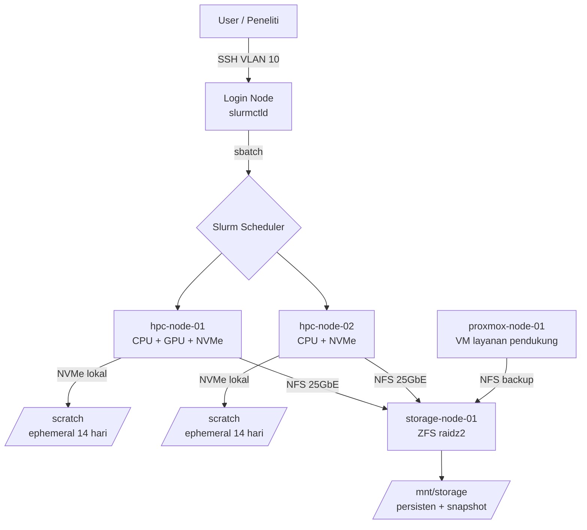

# Server Infrastructure — Bioinformatics Bare-Metal Cluster

> **REPOSITORY PRIVATE — INTERNAL USE ONLY**
> Repo ini berisi data aset, alamat IP manajemen (IPMI/iDRAC), topologi jaringan,
> dan serial number perangkat. **Dilarang** menjadikan repo ini public,
> fork ke akun personal, atau mem-push kredensial dalam bentuk apa pun.

| Item | Nilai |
|---|---|
| Nama Sistem | Bioinformatics HPC & Storage Infrastructure |
| Tipe Deployment | **100% Bare-Metal** (tanpa cloud, tanpa hypervisor di node compute) |
| Lokasi | Data Center Internal — Ruang Server Lantai 2 |
| Domain Internal | `.hpc.local` |
| Versi Dokumentasi | `v1.0.0` |
| Terakhir Diperbarui | 2026-08-28 |
| Pengelola (Sysadmin) | *(isi nama PIC)* |
| Kontak Darurat | *(isi email / no. HP)* |

---

## 1. Ringkasan

Infrastruktur ini didedikasikan untuk workload **bioinformatics**:
WGS/WES variant calling, RNA-Seq, assembly de-novo, metagenomics,
single-cell, dan alignment skala besar.

Karakteristik workload yang jadi dasar semua keputusan desain:

- **I/O-bound berat** — file intermediate (`.sam`) bisa 5–10× lebih besar dari input.
- **RAM-hungry** — assembler (SPAdes, Trinity) & STAR index bisa >200 GB RAM per job.
- **Long-running** — job bisa berjalan 12 jam – 7 hari, tidak boleh mati karena SSH putus.
- **Reproducibility wajib** — setiap tool dikunci versi via Conda env / Singularity image.

Konsekuensi arsitektural:
1. Scratch berbasis **NVMe lokal** dipisah total dari storage arsip.
2. Semua job **wajib** lewat scheduler (Slurm), tidak boleh nempel di sesi SSH.
3. Dokumentasi dibuat **per-unit fisik**, bukan per-cluster, karena setiap
   chassis punya serial, garansi, dan riwayat maintenance sendiri.

---

## 2. Arsitektur Umum

```
                        ┌───────────────────────────────┐
                        │   Uplink / Core Switch (LAN)  │
                        │        VLAN 10 (Mgmt)         │
                        │        VLAN 20 (Data)         │
                        │        VLAN 30 (IPMI)         │
                        └───────────────┬───────────────┘
                                        │
              ┌─────────────────────────┼─────────────────────────┐
              │                         │                         │
     ┌────────┴────────┐      ┌─────────┴────────┐      ┌─────────┴────────┐
     │  LOGIN / HEAD   │      │   COMPUTE TIER   │      │  VIRTUALIZATION  │
     │  (bare-metal)   │      │   (bare-metal)   │      │   (bare-metal)   │
     │                 │      │                  │      │                  │
     │ slurmctld       │      │ hpc-node-01      │      │ proxmox-node-01  │
     │ SSH gateway     │      │ hpc-node-02 ...  │      │  ├── VM: gitlab  │
     │ user home       │      │  └─ /scratch     │      │  ├── VM: db      │
     └────────┬────────┘      │     (NVMe lokal) │      │  └── LXC: monitor│
              │               └─────────┬────────┘      └─────────┬────────┘
              │                         │                         │
              └───────────┬─────────────┴─────────────┬───────────┘
                          │  NFS / 25GbE (MTU 9000)   │
                 ┌────────┴───────────────────────────┴────────┐
                 │           STORAGE TIER (bare-metal)         │
                 │             storage-node-01                 │
                 │   ZFS raidz2 → /mnt/storage  (arsip/final)  │
                 │   Snapshot harian + scrub bulanan           │
                 └─────────────────────────────────────────────┘
```

Versi Mermaid (dirender otomatis oleh GitHub):



### Peran tiap tier

| Tier | Node | Peran | Boleh Jalankan Job Berat? |
|---|---|---|---|
| Login/Head | `login-01` | Submit job, edit script, transfer file kecil | **TIDAK** |
| Compute | `hpc-node-01..NN` | Eksekusi pipeline via Slurm | Ya, **hanya via `sbatch`/`srun`** |
| Storage | `storage-node-01` | ZFS pool, NFS/SMB export, snapshot | **TIDAK** |
| Virtualisasi | `proxmox-node-01` | VM/LXC layanan (Git, DB, monitoring) | **TIDAK** |

---

## 3. Mapping Path Storage

Ini adalah kontrak paling penting di cluster. **Salah taruh file = pipeline lambat
10× atau storage arsip penuh.**

| Path | Sumber Fisik | Backing | Kapasitas | Sifat | Retensi | Backup/Snapshot |
|---|---|---|---|---|---|---|
| `/scratch` | Lokal di tiap HPC node | NVMe RAID0 (mdadm) | ±7 TB usable/node | **Ephemeral, super cepat** | Auto-purge **14 hari** sejak `atime` | **TIDAK ada backup** |
| `/scratch/$USER` | Lokal | NVMe | quota 3 TB/user | Workspace personal | 14 hari | Tidak |
| `/scratch/$USER/$SLURM_JOB_ID` | Lokal | NVMe | — | Workdir per-job (dibuat script) | Dihapus di akhir job | Tidak |
| `/mnt/storage` | `storage-node-01` via NFS | ZFS raidz2 HDD | 200 TB usable | **Persisten, lambat** | Selama proyek aktif | Snapshot harian |
| `/mnt/storage/raw` | NFS | ZFS | — | Data mentah, **read-only setelah ingest** | Permanen | Snapshot + replikasi |
| `/mnt/storage/projects/<nama-proyek>` | NFS | ZFS | quota per proyek | Hasil final (`.bam`, `.cram`, `.vcf`) | Permanen | Snapshot harian |
| `/mnt/storage/reference` | NFS | ZFS | ±8 TB | Genom referensi & index, **read-only** | Permanen | Snapshot mingguan |
| `/mnt/storage/backup` | NFS | ZFS | ±30 TB | Target `vzdump` Proxmox | 30 hari rotasi | Snapshot |
| `/home/$USER` | NFS (SSD mirror) | ZFS SSD | 2 TB total | Script, config, `.bashrc` | Permanen | Snapshot 4×/hari |
| `/opt/conda` | Lokal per node | SSD OS | 500 GB | Conda env bersama | — | Rebuild dari YAML |
| `/opt/containers` | NFS read-only | ZFS | 2 TB | Image Singularity/Apptainer (`.sif`) | Permanen | Snapshot |
| `/tmp` | Lokal | tmpfs (RAM!) | 64 GB | **JANGAN dipakai pipeline** | Reboot | Tidak |

### Aturan Emas Storage

1. **Semua proses baca-tulis intensif WAJIB di `/scratch`.**
   Jangan pernah menulis file intermediate langsung ke `/mnt/storage` (NFS) —
   itu akan membunuh throughput seluruh cluster untuk semua user.
2. **Alur data yang benar:**
   ```
   /mnt/storage/raw  ──(copy/stage-in)──►  /scratch/$USER/$JOB_ID
                                                │
                                          (proses berat)
                                                │
                              (kompres + copy hasil final saja)
                                                ▼
                                    /mnt/storage/projects/<proyek>
                                                │
                                     (hapus dir /scratch)
   ```
3. **Jangan simpan `.sam` di mana pun** setelah dikonversi ke `.bam`/`.cram`.
4. **Jangan pernah commit data biologis ke repo ini.** Lihat `.gitignore`.
5. `/tmp` adalah tmpfs (RAM). Menulis 50 GB ke `/tmp` = OOM Killer + node reboot.
   Set `export TMPDIR=/scratch/$USER/$SLURM_JOB_ID/tmp` di setiap job.

Detail lengkap prosedur ada di [`docs/sop/sop-bioinformatics-execution.md`](docs/sop/sop-bioinformatics-execution.md).

---

## 4. Index Node

Node yang **sudah terdata dengan data asli**:

| Node | Tipe | IP | Dokumentasi | Status |
|---|---|---|---|---|
| `proxmox` | Bare-metal Hypervisor (PVE 9.2) | `192.168.18.190` | [inventory/proxmox-nodes/proxmox.md](inventory/proxmox-nodes/proxmox.md) | 🟢 Production |

Legenda status: 🟢 Production · 🟡 Maintenance · 🔴 Down · ⚪ Decommissioned · 🔵 Staging

> **Catatan penting:** arsitektur di §2 dan mapping storage di §3 adalah **desain
> target** — node `login-01`, `hpc-node-01..NN`, dan `storage-node-01` di sana
> belum ada wujud fisiknya / belum didata. Satu-satunya node yang sudah terdata
> adalah `proxmox`, dan node itu saat ini merangkap tiga peran sekaligus
> (hypervisor + arsip 140 TB + target backup).
>
> Kerangka dokumen untuk tipe node lain ada di
> [`inventory/_templates/`](inventory/_templates/) — isinya contoh, bukan server nyata.
> Cara mendata node baru: [`docs/penginputan-node.md`](docs/penginputan-node.md).

---

## 5. Struktur Repository

| Path | Isi |
|---|---|
| `README.md` | Dokumen ini — pintu masuk, arsitektur, mapping storage |
| `CHANGELOG.md` | Riwayat versi **dokumentasi** (Keep a Changelog) |
| `.gitignore` | Rule ignore data biologis, kredensial, log |
| `inventory/` | Spesifikasi **hardware fisik** per unit bare-metal |
| `inventory/_templates/` | **Kerangka/contoh** dokumen node — disalin, tidak diedit |
| `inventory/hpc-nodes/` | Node compute *(belum ada isi)* |
| `inventory/storage-nodes/` | Node storage/NAS *(belum ada isi)* |
| `inventory/proxmox-nodes/` | Host hypervisor — berisi `proxmox.md` |
| `scripts/` | Kolektor data inventaris (read-only, dijalankan via SSH) |
| `docs/penginputan-node.md` | Panduan cara mendata & memperbarui node |
| `docs/sop/` | Standard Operating Procedure |
| `track-record/` | Riwayat operasional (maintenance & perubahan hardware) |
| `assets/images/` | Foto rak, diagram, screenshot |

**Beda `CHANGELOG.md` vs `track-record/server-changelog.md`:**
- `CHANGELOG.md` (root) = perubahan **dokumen/repo ini**.
- `track-record/server-changelog.md` = perubahan **fisik/konfigurasi server**.

---

## 6. Tata Cara Update Repo

### 6.1 Clone

```bash
git clone git@github.com:<org-anda>/server-infrastructure.git
cd server-infrastructure
```

### 6.2 Alur kerja (wajib pakai branch, jangan push langsung ke `main`)

```bash
# 1. Sinkronkan dulu
git checkout main
git pull --rebase origin main

# 2. Buat branch sesuai konvensi
git checkout -b docs/hpc-node-01-upgrade-ram

# 3. Edit file .md yang relevan
#    - inventory/... untuk perubahan spesifikasi
#    - track-record/server-changelog.md untuk mencatat perubahannya
#    - CHANGELOG.md untuk mencatat perubahan dokumen

# 4. Cek tidak ada file terlarang yang ikut ter-stage
git status
git add .
git status --short          # pastikan TIDAK ada .fastq/.bam/.vcf/.key/.pem/.env

# 5. Commit
git commit -m "docs(hpc-node-01): update kapasitas RAM 512GB -> 1TB"

# 6. Push & buka Pull Request
git push -u origin docs/hpc-node-01-upgrade-ram
```

### 6.3 Konvensi nama branch

| Prefix | Kegunaan | Contoh |
|---|---|---|
| `docs/` | Perubahan isi dokumentasi | `docs/storage-node-01-add-vdev` |
| `inventory/` | Tambah node baru | `inventory/add-hpc-node-03` |
| `sop/` | Revisi SOP | `sop/update-preflight-check` |
| `maint/` | Catatan maintenance | `maint/2026-09-05-firmware-idrac` |
| `fix/` | Koreksi data salah | `fix/typo-ipmi-hpc-node-02` |
| `chore/` | Housekeeping repo | `chore/update-gitignore` |

### 6.4 Konvensi commit (Conventional Commits)

```
<tipe>(<scope>): <deskripsi singkat, imperatif, huruf kecil>

[body opsional: alasan perubahan, referensi tiket]
```

| Tipe | Kapan dipakai |
|---|---|
| `docs` | Menulis/mengubah isi dokumentasi |
| `feat` | Menambah node / dokumen / section baru |
| `fix` | Memperbaiki informasi yang salah |
| `chore` | Struktur repo, `.gitignore`, template |
| `refactor` | Reorganisasi file tanpa ubah makna |

Contoh benar:
```
docs(storage-node-01): catat penggantian disk slot 7 karena SMART pending sector
feat(inventory): tambah dokumentasi hpc-node-03
fix(proxmox-node-01): koreksi IP VM db-postgres dari .45 ke .46
chore(gitignore): tambah rule *.cram dan *.bai
```

### 6.5 Checklist sebelum Pull Request

- [ ] Tidak ada file data biologis (`.fastq`, `.bam`, `.vcf`, `.sam`, `.sif`) yang ter-commit.
- [ ] Tidak ada kredensial (`.key`, `.pem`, `.env`, password IPMI plaintext).
- [ ] Field **"Terakhir Diperbarui"** di file yang diedit sudah diganti tanggalnya.
- [ ] Perubahan fisik server sudah dicatat di `track-record/server-changelog.md`.
- [ ] Gambar baru sudah mengikuti standar nama di `assets/images/README.md`.
- [ ] `CHANGELOG.md` sudah diperbarui di bagian `[Unreleased]`.
- [ ] Tabel Markdown ter-render rapi (cek di tab *Preview* GitHub).

### 6.6 Aturan keamanan konten

| Boleh dicatat | Tidak boleh dicatat |
|---|---|
| IP privat (10.x, 192.168.x) | Password / API token / private key |
| Serial number & asset tag | Isi file `.env` |
| Username admin | Hash password |
| Nama VLAN, subnet | Kredensial IPMI |

Simpan semua kredensial di password manager (Vaultwarden/Bitwarden), lalu di dokumen
cukup tulis referensinya:
```markdown
Kredensial IPMI: lihat entri Vaultwarden `IPMI / hpc-node-01`
```

Jika kredensial terlanjur ter-push: **rotasi kredensialnya dulu**, baru bersihkan history
(`git filter-repo`), lalu paksa push dan beri tahu semua anggota tim.

---

## 7. Pemanggilan Gambar dari `assets/images/`

Semua gambar disimpan di `assets/images/` dan dipanggil dengan **path relatif**
dari lokasi file `.md` yang memanggilnya.

### 7.1 Tabel prefix relatif

| File `.md` berada di | Prefix yang dipakai |
|---|---|
| Root (`README.md`, `CHANGELOG.md`) | `assets/images/...` |
| `docs/` | `../assets/images/...` |
| `docs/sop/` | `../../assets/images/...` |
| `inventory/_templates/` | `../../assets/images/...` |
| `inventory/hpc-nodes/` | `../../assets/images/...` |
| `inventory/storage-nodes/` | `../../assets/images/...` |
| `inventory/proxmox-nodes/` | `../../assets/images/...` |
| `track-record/` | `../assets/images/...` |

### 7.2 Sintaks

Dari `README.md` (root):
```markdown

```

Dari `inventory/hpc-nodes/hpc-node-01.md`:
```markdown

```

Dari `docs/sop/sop-bioinformatics-execution.md`:
```markdown

```

### 7.3 Mengatur lebar gambar

Markdown murni tidak bisa mengatur ukuran. Gunakan HTML (didukung GitHub):

```markdown

```

### 7.4 Gambar sebagai link (klik untuk ukuran penuh)

```markdown
[](../../assets/images/racks/hpc-node-01-rack.png)
```

Standar penamaan file lengkap: [assets/images/README.md](assets/images/README.md).

---

## 8. Cara Cepat Menambah Node Baru

Prosedur lengkap ada di **[`docs/penginputan-node.md`](docs/penginputan-node.md)**.
Ringkasnya:

```bash
# 1. Kumpulkan data dari server (read-only, tidak mengubah apa pun)
bash scripts/collect-proxmox.sh <ip> root ~/.ssh/<key> > /tmp/pve-$(date +%F).txt

# 2. Salin template — JANGAN edit file di _templates/
cp inventory/_templates/proxmox-node.template.md inventory/proxmox-nodes/<hostname>.md
cp inventory/_templates/hpc-node.template.md     inventory/hpc-nodes/<hostname>.md
cp inventory/_templates/storage-node.template.md inventory/storage-nodes/<hostname>.md
```

Lalu:
1. Isi dokumen dari output kolektor. Nama file = **hostname asli** (`hostname -f`),
   bukan nomor urut karangan.
2. Field yang tidak terbaca lewat SSH (rak, RU, PDU, PSU, garansi) **disurvei fisik**.
   Yang belum diketahui ditulis `*(isi)*`, jangan dikosongkan.
3. Tambahkan barisnya ke tabel **Index Node** di §4 README ini.
4. Catat perubahan fisik di `track-record/server-changelog.md`.
5. Tambahkan entri di `CHANGELOG.md` bagian `[Unreleased]`.

---

## 9. Kontak & Eskalasi

| Peran | Nama | Kontak | Tanggung Jawab |
|---|---|---|---|
| Sysadmin Utama | *(isi)* | *(isi)* | Semua node bare-metal, Slurm, ZFS |
| Sysadmin Cadangan | *(isi)* | *(isi)* | Backup PIC saat utama tidak tersedia |
| Bioinformatician Lead | *(isi)* | *(isi)* | Conda env, container, validasi pipeline |
| Vendor Hardware | *(isi)* | *(isi)* | RMA & garansi |
| Fasilitas / Listrik-AC | *(isi)* | *(isi)* | PDU, UPS, pendingin ruangan |

Prosedur eskalasi darurat (node down / pool degraded) ada di
[`track-record/maintenance-log.md`](track-record/maintenance-log.md).
